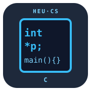

# C Programming

**Harbin Engineering University · Computer Science**

_A foundation course for first-year CS students._ From "hello&#41;" to pointers, memory,
data structures, and clean systems-level habits — the C that makes later courses (OS,
computer graphics, algorithms) make sense.

> 从 `hello` 起步，一路走到指针、内存管理、数据结构与系统级编程习惯——正是这些 C 语言功底，让后续的**操作系统、计算机图形学、算法**等课程真正变得可理解。



## Overview

| Week | Topic | Code |
|---|---|---|
| 1 | Program structure, types, I/O | `code/hello.c` |
| 2 | Control flow & functions | `code/functions.c` |
| 3 | Arrays, strings | `code/strings.c` |
| 4 | Pointers & memory model | `code/pointers.c` |
| 5 | Structs, dynamic allocation | `code/list.c` |
| 6 | Files, bit tricks, build basics | `code/bitops.c` |

## Set up (needs a C compiler)
- Windows: MinGW (`gcc`) or use **WSL**.
- macOS: `clang` ships with Xcode CLI tools.
- Linux: `apt install gcc make`.

```bash
git clone git@github.com:dapenglang/c-programming.git
cd c-programming
gcc code/hello.c -o hello && ./hello
```

## 核心要点
- 以 **sizeof** 为切入点建立内存的心智模型。
- 指针 = 地址 + 类型；数组会退化为指针；NULL 与野值的区别。
- **malloc/free** 的配对纪律，以及三大内存错误（泄漏、重复释放、越界访问）。
- 通过一个精简的动态链表，讲清所有权的转移。

## 考核方式
- 每周小作业 40% · 期中（字符串库）20% · 期末（小型链表/矩阵库）30% · 随堂测验 10%。

课程教学大纲、学时分配与考核方式见 [`docs/syllabus.md`](docs/syllabus.md)。

---

## 《计算思维与问题求解》综合实验教学包

本仓库收录《计算思维与问题求解》课程的全套教学材料，与非计算机专业大一学生的 C 语言教学配套。整个教学包由 **专业算法综合实验** 与 **知识点拆解练习** 两部分构成，二者互为支撑：前者是目标，后者是阶梯。

### 一、`专业算法综合实验/` —— 基于专业知识与算法的综合实验题目

本目录收录 **30 个综合实验题目**。这些题目不是抽象的编程练习，而是**从各专业的真实计算场景出发、以专业知识和算法为核心**设计的完整系统实现：每个题目都对应某个专业方向上一个真实存在的功能、模块或算法，学生要解决的是本专业里的真问题。

综合实验考查学生**综合运用 C 语言知识实现专业算法与系统**的能力，单个项目的代码量在 **1200～1600 行**。学生需要**阅读相关论文、调研本行业应用现状、理解题目要求的计算流程**，再动手实现——这正是综合实验与普通编程作业的区别。

每个题目按"数据读入 → 算法实现 → 数据输出"组织为至少 6 个功能模块，并给出每模块的功能说明与输入输出要求，便于分组分工。

| 学院 | 编号范围 | 题量 |
|---|---|---|
| 航建学院（2 系） | A1 ～ A10 | 10 |
| 人工智能学院（4 系） | B1 ～ B10 | 10 |
| 水声学院（5 系） | C1 ～ C5 | 5 |
| 核学院（15 系） | D1 ～ D5 | 5 |

### 二、`知识点拆解练习/` —— 对综合实验题目的拆解，按基础知识点分级练习

本目录收录 **140 道配套练习题**，它的作用是把上面 30 个综合实验题目**按基础知识点拆解开来**：综合实验中要用到的每一项基础技能，在这里都被还原成一道独立的小练习，学生在教学过程中**逐章、逐步地**把这些知识点练熟，最终自然具备完成综合实验的能力。

题目场景全部取自综合实验，学生做练习时就在接触真实实验的语境；每题只使用当章及之前章节的知识点，边界严格递进；题量 140 道（第 2～8 章，每章 20 题），代码 10～40 行、建议用时 20～30 分钟，学生做完练习即可无缝进入综合实验。

### 三、面向"教"与"学"的完整设计

为更好地服务教师的**教**和学生的**学**，每个题目都提供了详细的**专业背景介绍、输入输出要求、数据集规范**等材料：

- **教师**：可直接用于课堂讲授、布置作业与实验指导，无需另行准备背景资料；
- **学生**：可独立读懂题目的专业语境与实现要求，按模块分工推进。

由此形成 **专业知识** 与 **编程技能** 两条主线并行推进的教学结构，在掌握 C 语言的同时理解专业问题的求解方法，系统提升学生的计算思维与解决复杂问题的能力。

### 目录导航

| 目录 | 内容 |
|---|---|
| [`专业算法综合实验/`](专业算法综合实验/README.md) | **30 个基于专业知识与算法的综合实验题目**（航建 A1～A10、人工智能 B1～B10、水声 C1～C5、核 D1～D5），每题一个真实的专业计算系统，代码量 1200～1600 行；另含文档规范、研究报告撰写指南与课程说明 |
| [`知识点拆解练习/`](知识点拆解练习/README.md) | **140 道基础知识点练习**（第 2～8 章，每章 20 题），把综合实验题目按知识点逐项拆解散练习，随教学进度逐步渗透；每题含「题干」与「讲解与答案」两文档 |

综合实验题目清单见 [`专业算法综合实验/V3-题目库/目录.md`](专业算法综合实验/V3-题目库/目录.md)，
知识点拆解练习完整索引见 [`知识点拆解练习/README.md`](知识点拆解练习/README.md)。